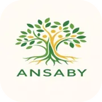
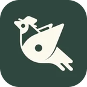
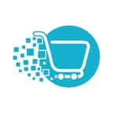

<a href="https://eslamnegm010.github.io">
  <picture>
    <source media="(prefers-color-scheme: dark)" srcset="assets/banner-dark.svg">
    
  </picture>
</a>

  
  
  
  

I build scalable, high-performance apps for iOS and Android, turning complex business requirements into smooth products people enjoy using. Clean Architecture keeps every codebase easy to grow, and I take an app from the first screen to the store release. I have shipped games, e-commerce, booking, social, event and enterprise apps.

## Apps on the stores

<table>
  <tr>
    <td width="72"></td>
    <td><b>Hazzoura</b> · Game A party game with a luxury feel for the Saudi, UAE and Kuwait majlis: daily challenges, online rooms with a code, offline pass-and-play and tournaments. I built the app, the Flutter Web admin panel and the Firebase backend on my own.</td>
    <td width="120"><a href="https://apps.apple.com/sa/app/id6792533203">App Store</a> <a href="https://play.google.com/store/apps/details?id=com.aty.hazzoura">Google Play</a></td>
  </tr>
  <tr>
    <td></td>
    <td><b>SELA Super App</b> · Enterprise One app for an employee's whole workday at Sela, a leading Saudi company, on iPhone and iPad: HR services, SELA Academy courses, travel booking and a social feed, behind admin-approved access with AES/RSA encryption.</td>
    <td><a href="https://apps.apple.com/sa/app/id6504908987">App Store</a> <a href="https://play.google.com/store/apps/details?id=sa.sela.superapp">Google Play</a></td>
  </tr>
  <tr>
    <td></td>
    <td><b>Hajj Expo</b> · Event The official app of the Hajj Conference &amp; Exhibition, for officials and companies from 95+ countries: a digital entry badge, the full agenda, an interactive venue map and a VR tour of the exhibition.</td>
    <td><a href="https://apps.apple.com/sa/app/id6753938620">App Store</a> <a href="https://play.google.com/store/apps/details?id=sa.sela.HajjExpo">Google Play</a></td>
  </tr>
  <tr>
    <td></td>
    <td><b>Falcon &amp; Hunting Exhibition</b> · Event The official guide to one of Saudi Arabia's largest cultural events: discover exhibitors, speakers and workshops, get your tickets and plan your visit on the floor plan.</td>
    <td><a href="https://apps.apple.com/sa/app/id6751438319">App Store</a> <a href="https://play.google.com/store/apps/details?id=sa.sela.falconexpo">Google Play</a></td>
  </tr>
  <tr>
    <td></td>
    <td><b>Ansaby</b> · Social Build your family tree, invite relatives and keep in touch: an interactive tree with two rendering engines, chat with voice messages, family games and PNG/PDF tree export.</td>
    <td><a href="https://apps.apple.com/sa/app/id6762079478">App Store</a> <a href="https://play.google.com/store/apps/details?id=com.sahers.ansabyApp">Google Play</a></td>
  </tr>
  <tr>
    <td></td>
    <td><b>Slots</b> · Booking Book salons, spas and barbers near you, for men and women, with real-time availability, instant booking and pay-ahead to hold the slot.</td>
    <td><a href="https://apps.apple.com/sa/app/id6469031888">App Store</a></td>
  </tr>
  <tr>
    <td></td>
    <td><b>Square</b> · Grocery Everything for the home in one app, with a built-in wallet for fast checkout and cashback offers.</td>
    <td><a href="https://apps.apple.com/sa/app/id1626286616">App Store</a></td>
  </tr>
  <tr>
    <td></td>
    <td><b>Melocanna</b> · Furniture An editorial shopping experience for premium handcrafted rattan and bamboo furniture.</td>
    <td><a href="https://apps.apple.com/sa/app/id6502879449">App Store</a></td>
  </tr>
</table>

## Open source

**[reminder_App](https://github.com/eslamnegm010/reminder_App)**: time and location based reminders with Flutter Map, Geolocator and local notifications. Fully offline with Hive, complete English/Arabic localization with RTL layouts, Clean Architecture and Cubit.

## Toolbox

| Area | Tools |
|---|---|
| Languages & frameworks | Dart · Flutter (iOS, Android, Web) |
| Architecture | Clean Architecture · MVVM · SOLID · Feature-first · Melos monorepo |
| State & DI | BLoC / Cubit · Provider · GetX · GetIt · Injectable |
| Networking | REST · Dio · Retrofit · WebSockets |
| Firebase | Auth · Firestore · Realtime DB · Storage · Cloud Functions · FCM · Remote Config · Crashlytics · App Check |
| UI | Custom widgets · Animations · CustomPainter · Theming · Localization & RTL · GoRouter · AutoRoute · Deep links |
| Security & storage | AES / RSA · Secure storage · Hive · SQLite · Offline-first |
| Monetization | AdMob · RevenueCat · In-app purchases |
| Delivery & quality | Git · Azure Pipelines · Fastlane · Shorebird · Unit and widget tests · DevTools profiling |

<a href="https://eslamnegm010.github.io"><b>See the apps in action on my portfolio →</b></a>

